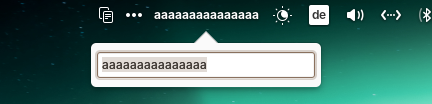

#  Wingpanel Simple Things Indicator




## Hey

Still working on this!


  
## For developers

You'll need the following dependencies:

- libglib2.0-dev
- libgranite-dev
- libindicator3-dev
- libwingpanel-dev
- valac
- meson (>= 0.58)

Install them with:

```bash
sudo apt install libglib2.0-dev libgranite-dev libwingpanel-dev libindicator3-dev valac meson
```

Run meson to configure the build environment and then ninja to build and install:

```bash
meson build --prefix=/usr
cd build
ninja
ninja install
```

Reboot (`reboot`) or kill Wingpanel (`killall io.elementary.wingpanel`)

To uninstall with ninja:

- Open a terminal in the build folder.
- Run `sudo ninja uninstall`

Reboot (`reboot`) or kill Wingpanel (`killall io.elementary.wingpanel`)

## Credits

