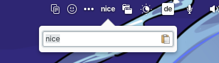

<div align="center">
  <h1 align="center">Simple Things</h1>
  <h3 align="center">Simply display some text in the elementary OS top bar</h3>
</div>

<div align="center">
    <span align="center">
        
    </span>
</div>
</br>
Pretty much the elementary OS pendant of https://github.com/one-thing-gnome/one-thing


## 🛣️ Roadmap

Still working on this!
 - Repair translations (needed? idk.)
 - Figure out how to do a deb file
   

Note: You can change entry text alignment setting (hidden in dconf atm)

  
## 💝 Donations

Support is always welcome and shows us that people want this to continue.

Stella, current main dev:
<p align="left">
  <a href="https://ko-fi.com/teamcons">
    
  </a>
</p>


## 🏗️ Building

Install dependencies with:

```bash
sudo apt install libglib2.0-dev libgranite-dev libwingpanel-dev valac meson
```

Run `meson` to configure the build environment and then `ninja` to build

```bash
meson build --prefix=/usr
cd build
ninja
```

To install

```bash
sudo ninja install
```

To uninstall, same but "uninstall"
